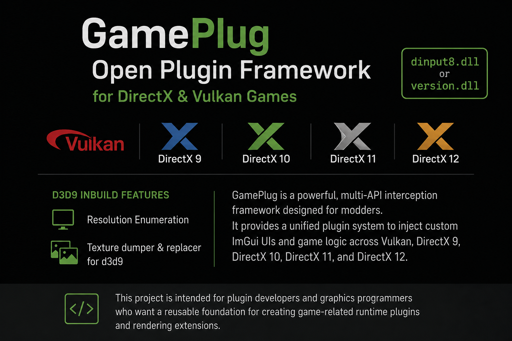

# 🚀 GamePlug: The Universal Plugin Layer

<p align="center">
  
</p>

[](https://ko-fi.com/rohitdev)

GamePlug is a powerful, multi-API interception framework designed for modders. It provides a unified plugin system to inject custom ImGui UIs and game logic across **Vulkan**, **DirectX 9**, **DirectX 10**, **DirectX 11**, and **DirectX 12**.

## ✨ Key Features

*   **Multi-API Support**: One framework to rule them all. Works seamlessly with Vulkan, D3D9, D3D10, D3D11 and D3D12.
*   **Unified Plugin System**: Build plugins once using a clean C++ interface. No need to worry about the underlying rendering backend.
*   **ImGui Integration**: Full support for Dear ImGui overlays with shared context between the host and plugins.
*   **Cross-Architecture**: Supports both x32 (Legacy/DXVK titles) and x64 (Modern titles).

## 🔧 Usage

Copy the selected proxy DLL beside the game's executable, then launch the game normally.

| Backend | Recommended proxy | Alternatives |
| --- | --- | --- |
| Vulkan | `dinput8.dll` | `version.dll`, `winmm.dll` |
| D3D9 | `dinput8.dll` | `version.dll`, `winmm.dll` |
| D3D10 | `dinput8.dll` | `version.dll`, `winmm.dll` |
| D3D11 | `dinput8.dll` | `version.dll`, `winmm.dll` |
| D3D12 | `dinput8.dll` | `version.dll`, `winmm.dll` |

Only place one GamePlug proxy DLL in the game directory at a time.

### ⌨️ Toggle Overlay

Once the game is launched with GamePlug, you can toggle the visibility of the ImGui overlay using any of the following shortcut keys:
- `Ctrl + F1`
- `~`


## 🛠 Build Instructions

GamePlug supports both x32 (x86) and x64 builds. **x32 is often the primary target** for older games utilizing DXVK.

### Requirements
- **CMake** (v3.20+)
- **Visual Studio 2026** with C++ Desktop Development

### 1. Build x32 (Legacy Support)
```powershell
cmake -B build32 -A Win32
cmake --build build32 --config Release
```

### 2. Build x64 (Modern Titles)
```powershell
cmake -B build64 -A x64
cmake --build build64 --config Release
```

## 📦 Outputs

| Backend | Architecture | Output folder | Available proxy DLLs |
| --- | --- | --- | --- |
| Vulkan | x32, x64 | `bin/<architecture>` | `dinput8.dll`, `version.dll`, `winmm.dll` |
| D3D9 | x32 | `bin/x32/d3d9` | `dinput8.dll`, `version.dll`, `winmm.dll` |
| D3D10 | x32 | `bin/x32/d3d10` | `dinput8.dll`, `version.dll`, `winmm.dll` |
| D3D11 | x32, x64 | `bin/<architecture>/d3d11` | `dinput8.dll`, `version.dll`, `winmm.dll` |
| D3D12 | x64 | `bin/x64/d3d12` | `dinput8.dll`, `version.dll`, `winmm.dll` |

## 📖 Documentation

- [Plugin Development Guide](docs/PLUGIN_DEVELOPMENT.md) - Learn how to build your own plugins.
- [Plugin Usage Guide](docs/PLUGIN_USAGE.md) - How to install and manage plugins.
- [Games Compatibility List](GAMES_COMPATIBILITY_LIST.md) - Supported games and their compatible layers.
- [Changelog](CHANGELOG.md) - Track recent changes and updates.

## 🤝 Contributing

Contributions are welcome! Please see [CONTRIBUTING.md](CONTRIBUTING.md) for guidelines on how to report bugs, suggest features, and submit pull requests. All contributors are expected to follow our [Code of Conduct](CODE_OF_CONDUCT.md).

## 📄 License

This project is licensed under the MIT License - see the [LICENSE](LICENSE) file for details.
